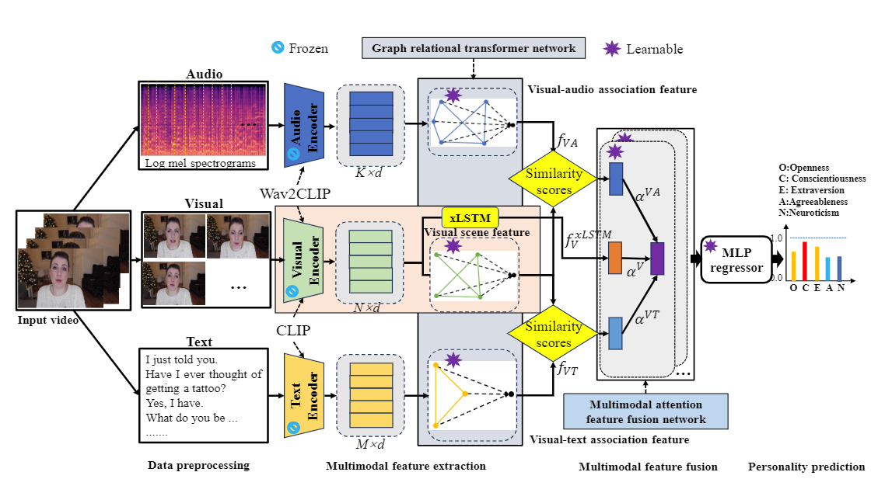

### A novel multimodal personality prediction method based on pretrained models and graph relational transformer network



工具包：requirements.txt


baseModel.py  子模块

model_pre.py  模型代码

utils.py  数据加载器

*_label2.csv  可用数据及标签

训练步骤：

Download the 'data' folder from [this link](https://drive.google.com/drive/folders/1gqWld1gKC2M-cF7C5ZL4kFAiZiHTfToO?usp=sharing) and unzip it to the root directory of the project. Run the following command:

Train ：

```python
python train.py
```

Test:

Download the 'checkpoint' folder from [this link](https://drive.google.com/drive/folders/1gqWld1gKC2M-cF7C5ZL4kFAiZiHTfToO?usp=sharing) and unzip it to the root directory of the project. Run the following command:

```python
python test.py
```

